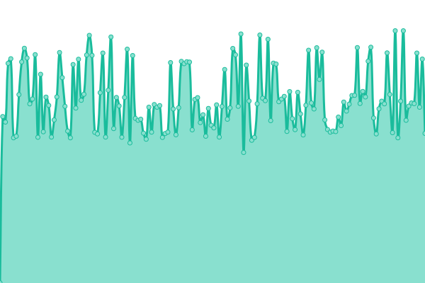

# [📈 Live Status](https://ville-ge.github.io/dsic-upptime): <!--live status--> **🟧 Partial outage**

This repository contains the open-source uptime monitor and status page for [ville-ge](https://ville-ge.github.io/dsic-upptime), powered by [Upptime](https://github.com/upptime/upptime).

With [Upptime](https://upptime.js.org), you can get your own unlimited and free uptime monitor and status page, powered entirely by a GitHub repository. We use [Issues](https://github.com/ville-ge/dsic-upptime/issues) as incident reports, [Actions](https://github.com/ville-ge/dsic-upptime/actions) as uptime monitors, and [Pages](https://ville-ge.github.io/dsic-upptime) for the status page.

<!--start: status pages-->
<!-- This summary is generated by Upptime (https://github.com/upptime/upptime) -->
<!-- Do not edit this manually, your changes will be overwritten -->
<!-- prettier-ignore -->
| URL | Status | History | Response Time | Uptime |
| --- | ------ | ------- | ------------- | ------ |
|  [Geneve.ch](https://www.geneve.ch/fr) | 🟩 Up | [geneve-ch.yml](https://github.com/ville-ge/dsic-upptime/commits/HEAD/history/geneve-ch.yml) | 

 1378ms
     
 | 

<a href="https://ville-ge.github.io/dsic-upptime/history/geneve-ch">100.00%</a>
    

|  [MEG](https://www.meg.ch/fr) | 🟩 Up | [meg.yml](https://github.com/ville-ge/dsic-upptime/commits/HEAD/history/meg.yml) | 

 1178ms
     
 | 

<a href="https://ville-ge.github.io/dsic-upptime/history/meg">100.00%</a>
    

|  [CJBG](https://www.cjbg.ch/fr) | 🟩 Up | [cjbg.yml](https://github.com/ville-ge/dsic-upptime/commits/HEAD/history/cjbg.yml) | 

 2250ms
     
 | 

<a href="https://ville-ge.github.io/dsic-upptime/history/cjbg">100.00%</a>
    

|  [FMAC](https://www.fmac-geneve.ch/fr) | 🟥 Down | [fmac.yml](https://github.com/ville-ge/dsic-upptime/commits/HEAD/history/fmac.yml) | 

 952ms
     
 | 

<a href="https://ville-ge.github.io/dsic-upptime/history/fmac">100.00%</a>
    

<!--end: status pages-->

[**Visit our status website →**](https://ville-ge.github.io/dsic-upptime)

## 📄 License

- Powered by: [Upptime](https://github.com/upptime/upptime)
- Code: [MIT](./LICENSE) © [ville-ge](https://ville-ge.github.io/dsic-upptime)
- Data in the `./history` directory: [Open Database License](https://opendatacommons.org/licenses/odbl/1-0/)
